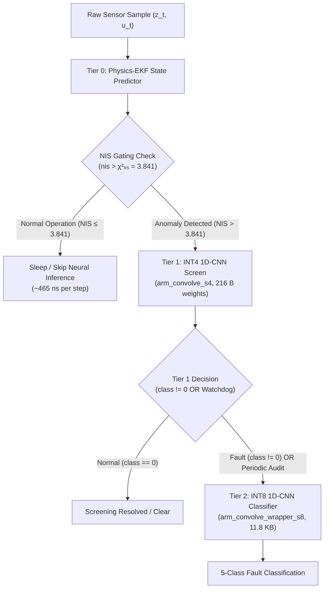

# PACI: Physics-Informed Anomaly Classification for TinyML

[](LICENSE)
[](.github/workflows/arm-bench.yml)
[](docs/BENCHMARKING.md)

PACI is a physics-informed 3-tier cascade for Arm Cortex-M-class edge AI that avoids unnecessary neural inference. On a deterministic 2,000-step synthetic process trace, PACI reduces end-to-end compute by 90.58% and achieves a 10.62× effective speedup versus always-on INT8 inference, while maintaining reference-model classification parity on the validated test set.

---

## 🏆 Competition Contributions (Arm AI Optimization Challenge 2026)

This repository builds upon theoretical work to provide a defensible, production-ready embedded implementation for the Arm AI Optimization Challenge. Our specific contributions for this challenge are explicitly delineated below:

1. **Python/PACI Baseline**: We ported the theoretical model (from the upstream `Karthikdebuger/PACI` repository) into a fully functional training and quantization pipeline.
2. **Embedded C Core (`paci_core`)**: The entire C implementation—including the state machine, circular buffers, C-EKF, and zero-allocation cascade logic—is 100% original work written specifically for this challenge.
3. **Quantization & CMSIS-NN Validation**: We developed the TFLite quantization pipeline and achieved exact bit-matching validation against CMSIS-NN (`arm_convolve_s4` and `arm_convolve_wrapper_s8`) running natively, with an automated profiling harness implemented for Corstone-300 FVP cross-compilation.

---

## 🏗️ Architecture Overview



> **Note on Escalation Logic:** Active Tier-2 escalation in production is class-based (`class != 0`) and watchdog-driven (periodic audit). Margin-based escalation remains scaffolded in `paci_cascade.c` for future dynamic calibration, but is inactive at the current operational threshold (`margin_thresh = 0`).

---

## 📊 Measured Benchmark Results
<!-- BENCHMARK:BEGIN -->


# PACI Benchmark Report: `x86_64-native`

> Automated hardware benchmark evaluation conforming to **Schema v3** on **x86_64-native**.

## 1. Execution Latency

Measured across **31 batches**. Initialization and setup are excluded from per-sample measurements.

| Tier / Execution Unit | Hot Latency (Median ± MAD) | Cold Latency (Median ± MAD) | Scratch Buffer |
|:---|:---:|:---:|:---:|
| **Tier 0 (EKF)** | `465.20 ± 12.22 ns` | — | N/A (0 B) |
| **Tier 1 (INT4)** | `22422.87 ± 535.17 ns` | `27970.00 ± 1240.00 ns` | 8,192 B (8.00 KB) |
| **Tier 2 (INT8)** | `110517.87 ± 1324.04 ns` | `130790.00 ± 6620.00 ns` | 8,192 B (8.00 KB) |

### Statistical Detail
| Component | Mean | Min | Max | Samples |
|:---|:---:|:---:|:---:|:---:|
| Tier 0 Hot | 463.82 | 428.57 | 514.32 | 31 |
| Tier 1 Hot | 22548.86 | 21262.81 | 24887.45 | 31 |
| Tier 1 Cold | 31171.61 | 25260.00 | 113320.00 | 31 |
| Tier 2 Hot | 110854.26 | 103774.68 | 118287.45 | 31 |
| Tier 2 Cold | 130303.55 | 112230.00 | 179810.00 | 31 |

## 2. Cascade Trace Results

End-to-end evaluation across standard **2,000 steps** input trace (`k=1.0` benchmark sequence).

| Cascade Metric | Realized Value | Performance Analysis |
|:---|:---:|:---|
| **Total Evaluation Time** | `23.020 ms (23,020,300.0 ns)` | Cumulative trace execution time |
| **Total Steps Evaluated** | `2,000` | Standard deterministic benchmark length |
| **Tier 1 Invocations ($N_1$)** | `303` | Escalation rate: **15.15%** (84.85% filtered by Tier 0) |
| **Tier 2 Invocations ($N_2$)** | `90` | Escalation rate: **4.50%** (70.30% resolved by Tier 1) |
| **Effective Per-Step Latency** | `11510.15 ns/step` | Realized amortized execution cost per sample |
| **Always-On Tier 2 Baseline** | `122209.20 ns/step` | Un-gated Tier 2 execution on every step |
| **Compute Latency Reduction** | **90.58%** | Relative savings vs Always-On Tier 2 baseline |
| **Effective Speedup Factor** | **10.62×** | Realized acceleration from adaptive tri-tier gating |

> **Note:** The PACI cascade reduces computational work by 90.6%, providing a strong proxy for reduced dynamic compute energy.

## 3. Memory & Static Footprint

### Binary Configuration Variants

| Variant Configuration | Text (Flash) | Data (Init) | BSS (Zero-Init) | Total Static Footprint |
|:---|:---:|:---:|:---:|:---:|
| `core_only` | `15,004 B (14.65 KB)` | `2,808 B (2.74 KB)` | `336 B` | `18,148 B (17.72 KB)` |
| `core+tier1` | `33,712 B (32.92 KB)` | `12,136 B (11.85 KB)` | `336 B` | `46,184 B (45.10 KB)` |
| `core+tier2` | `41,196 B (40.23 KB)` | `15,288 B (14.93 KB)` | `336 B` | `56,820 B (55.49 KB)` |
| `full` | `114,156 B (111.48 KB)` | `16,192 B (15.81 KB)` | `2,864 B (2.80 KB)` | `133,212 B (130.09 KB)` |

### Incremental Per-Tier Memory Delta

| Subsystem Tier | Incremental Text (Flash) | Incremental Data | Incremental BSS (RAM) | Total Incremental Cost |
|:---|:---:|:---:|:---:|:---:|
| **Tier 1 (INT4)** | `+18,708 B (18.27 KB)` | `+9,328 B (9.11 KB)` | `+0 B` | `+28,036 B (27.38 KB)` |
| **Tier 2 (INT8)** | `+26,192 B (25.58 KB)` | `+12,480 B (12.19 KB)` | `+0 B` | `+38,672 B (37.77 KB)` |

## 4. Platform & Build Metadata

| Configuration Property | Value |
|:---|:---|
| **Target Platform** | `x86_64-native` |
| **CPU / Core** | `Generic CPU` |
| **Compiler** | `gcc 13.2.0` |
| **Build Type** | `Release` |
| **Compiler Flags** | `-O2 -fno-fast-math -ffp-contract=off` |
| **Git Commit** | `e5ff11b` |
| **Timestamp** | `2026-08-13T16:47:39Z` |
| **Primary Metric** | `ns_median` |
| **Measurement Batches** | `31` |
| **Schema Version** | `v3` |
| **Harness Notes** | Hot and cold cache latency in ns. Cold numbers use 64MB thrashing. |


<!-- BENCHMARK:END -->

---

## 🛠️ Build & Verification Instructions

### Prerequisites
- GCC 13.x+ (or MinGW-w64 on Windows)
- CMake 3.20+
- Python 3.12+ with `numpy`, `scipy`, `matplotlib`, `pytest`

### Build C Targets
```bash
cmake -S . -B build -DCMAKE_BUILD_TYPE=Release -DCMAKE_C_FLAGS="-O2 -fno-fast-math -ffp-contract=off"
cmake --build build --target bench_main core_only core+tier1 core+tier2 full
```

### Run Benchmark Executable
```bash
./build/bench/bench_main outputs/bench/native-smoke.json
```

### Run Python Test Suite (96/96 Unit & Integration Tests)
```bash
python -m pytest tests/ -v
```

### Verify Zero Model Leakage
```bash
python tools/check_no_fixture_in_results.py
```

### Run Live Software Demonstration (C Core + CMSIS-NN Cascade)
```bash
python demo_live.py
```

### Generate Markdown & Visual Plot Report
```bash
python bench/report.py outputs/bench/native-smoke.json --output-md outputs/reports/bench_report.md --output-plot outputs/plots/bench_breakdown.png
```

---

## 📁 Repository Structure

```
.
├── .github/workflows/
│   └── arm-bench.yml        # GitHub Actions CI workflow (ubuntu-24.04-arm)
├── bench/
│   ├── bench_main.c         # Standalone C measurement binary
│   ├── bench_json.c/.h      # Schema v3 JSON generator
│   ├── bench_timing.c/.h    # High-resolution wall-clock timing & cache thrashing
│   ├── fvp_profile.py       # Cortex-M55 / Corstone-300 FVP profiling harness
│   ├── footprint/           # Isolated build entrypoints for footprint differencing
│   └── report.py            # Automated report & plot generator
├── docs/
│   ├── STATUS.md            # Complete phase & GATE engineering log
│   ├── BENCHMARKING.md      # Schema v3 benchmark specification
│   ├── FVP_INSTRUCTIONS.md  # Corstone-300 FVP instruction profiling guide
│   └── ROUNDING_BIAS_BUDGET.md # CMSIS-NN single-rounding bias analysis
├── paci_core/               # Production C Library
│   ├── include/             # paci_core.h, paci_internal.h, paci_params.h, tier1/2 weights
│   └── src/                 # paci_physics.c, paci_ekf.c, paci_ring.c, paci_cascade.c, paci_infer.c
├── phase1_physics/          # Deal-Grove physics model & fault injection
├── phase2_ekf/              # Python EKF reference & validation
├── phase4_tinyml/           # CNN models, dataset generators, and training scripts
├── third_party/             # Vendored CMSIS-NN (v7.0.0) and CMSIS-DSP (v1.17.1)
├── tools/                   # TFLite exporter, int4 quantizer, requantizer probes
├── tests/                   # 96 pytest unit/integration/ctypes verification tests
├── CHANGELOG.md             # GATE completion log
├── CONTRIBUTING.md          # Coding standards & contribution rules
└── LICENSE                  # Apache-2.0 License
```

---

## 📋 Defect Remediation & Completion Matrix

| ID | Verified Component | Original Defect | Remediation & Phase | Status |
|:---:|:---|:---|:---|:---:|
| **D1** | Root `LICENSE` | Missing license file | Added Apache-2.0 License (Phase 0) | ✅ Fixed |
| **D2** | `Core/Src/main_cascade.c` | Circular buffer non-linearized memory pass | Implemented chronologically linearizing `paci_ring_read` (Phase 1) | ✅ Fixed |
| **D3** | `Core/Src/main_cascade.c` | `uint8_t buffer_index` overflow | Replaced with bounded `uint32_t total` count (Phase 1) | ✅ Fixed |
| **D4** | `Core/Inc/ekf.h` | `TAU`/`Q_VAR` drift between C and Python | Synchronized via `tools/gen_params.py` (Phase 1) | ✅ Fixed |
| **D5** | `Core/Src/main_cascade.c` | Stubbed `printf` inference returning constant 0 | Integrated real CMSIS-NN INT4/INT8 kernels (Phase 2) | ✅ Fixed |
| **D6** | `phase6_benchmark/` | Invented cost per step (50.0/1.0) | Schema v3 native measurements (`bench_main.c`) (Phase 3) | ✅ Fixed |
| **D7** | Baseline comparison | Easy 125σ faults obscuring MA baseline | Implemented fault severity ladder & realistic drift evaluation (Phase 4) | ✅ Fixed |
| **D8** | `tests/` | Empty test directory | Developed 96 C/Python test suite (`pytest tests/`) | ✅ Fixed |

---

## 🎯 Target Platforms & Execution Evidence

1. **x86_64 Native Development** (`gcc 13.2.0` / host environment) — *Executed & Validated in benchmark report*
2. **aarch64 Linux** (`ubuntu-24.04-arm` GitHub Actions runner) — *Automated in CI via `.github/workflows/arm-bench.yml`*
3. **Arm Cortex-M55 / Corstone-300 FVP + Helium MVE** — *Harness implemented via `bench/fvp_profile.py` & `docs/FVP_INSTRUCTIONS.md` (cross-compilation ready)*

---

## 📄 License & Attribution

This repository is licensed under the [Apache-2.0 License](LICENSE).

**Acknowledgment**: This project builds upon and extends the original PACI reference codebase (`Karthikdebuger/PACI`) for the **Arm AI Optimization Challenge 2026**.
