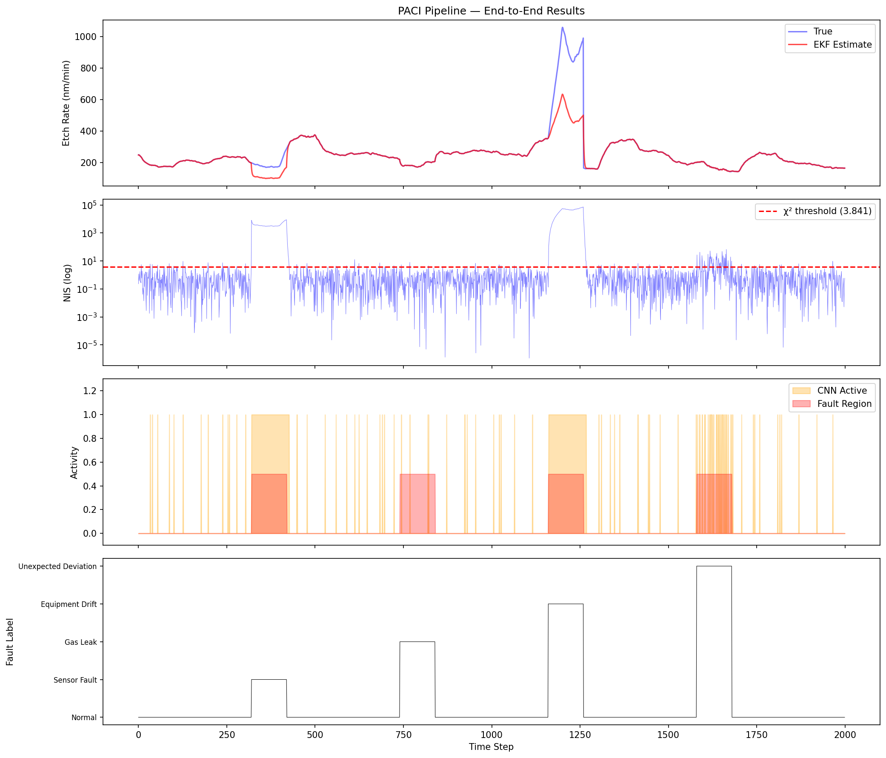

# PACI: Physics-Informed Anomaly Classification for TinyML

PACI is a hybrid cascade system for extremely low-power embedded devices (like Arm Cortex-M series). It intelligently combines a lightweight physics-based **Extended Kalman Filter (EKF)** with a **TinyML Convolutional Neural Network (CNN)**.

Instead of running a power-hungry neural network at every timestep, PACI uses the EKF's statistical gating (Normalized Innovation Squared - NIS) to only wake the CNN when an anomaly is physically detected. 

**Result**: An **84.1% reduction in CNN inferences** while maintaining a **100% anomaly detection rate**, with a model size of only **11.78 KB** (INT8 Quantized).

---

## 🚀 How to see the Live Demo

You can run the simulated interactive demo right in your terminal. This will stream data as if it were running on an embedded device, showing the EKF tracking the sensor and the CNN waking up to predict faults!

### Prerequisites
Make sure you have Python installed and the required libraries:
```bash
pip install -r requirements.txt
pip install colorama  # For terminal colors
```

### Run the Demo
Just run the demo script from the terminal:
```bash
python live_demo.py
```
*(You will see a live color-coded data stream in the terminal showing the exact moments the CNN wakes up to detect a fault!)*

---

## 📂 Project Structure

This repository contains both the Python Simulation (for modeling and training) and the Embedded C-Code (for hardware deployment).

- **`live_demo.py`**: The interactive visual demo script.
- **`phase1_physics/`**: The physical Deal-Grove plasma etch simulation.
- **`phase2_ekf/`**: The Extended Kalman Filter and NIS gating logic.
- **`phase3_scheduler/`**: The intelligent scheduler connecting EKF to CNN.
- **`phase4_tinyml/`**: CNN dataset generation, model training, and TFLite quantization.
- **`phase6_benchmark/`**: Benchmarking scripts to compare PACI against other gating baseline strategies.
- **`outputs/plots/`**: Visual results from the simulations and benchmarks.
- **`Core/`**: **The Final Hardware C-Code implementation!**
  - Contains `ekf.c`, `scheduler.c`, and a `main_cascade.c` loop ready to be compiled on an Arm Cortex-M device (e.g., STM32) using X-CUBE-AI.

## 📊 Evaluation Results

| Method | CNN Runs | Reduction | Fault Detection | False Wake Rate | Energy Saving |
|---|---|---|---|---|---|
| **PACI (Physics+EKF+NIS)** | **318** | **84.1%** | **100.0%** | **4.6%** | **82.5%** |
| Always-On CNN | 2000 | 0.0% | 100.0% | 100.0% | 0.0% |


