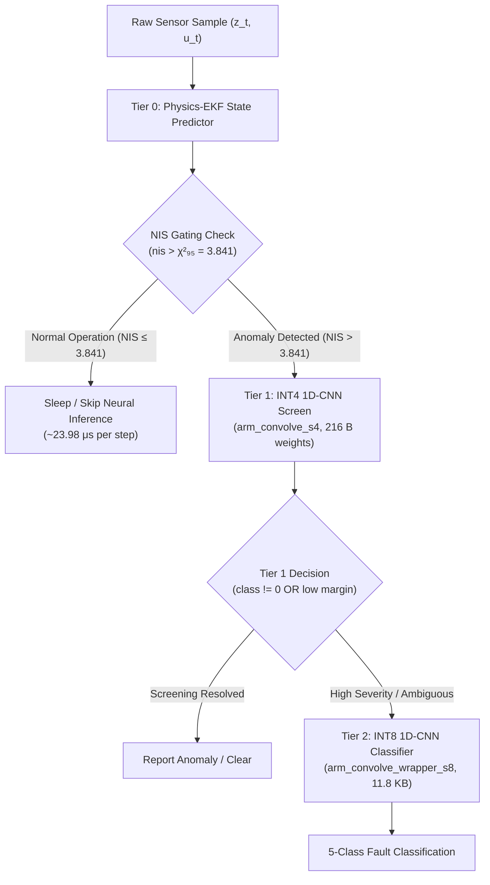

# PACI-Arm: Evidence-Proportional Inference on Arm

## 0. TARGET DECLARATION — fill this in before starting
AVAILABLE_HARDWARE: "none"

# PACI: Physics-Informed Anomaly Classification for TinyML

[](LICENSE)
[](.github/workflows/arm-bench.yml)
[](docs/BENCHMARKING.md)

PACI is an ultra-low-power 3-tier adaptive cascade architecture designed for resource-constrained Arm Cortex-M embedded microcontrollers and Linux edge systems monitoring semiconductor plasma etch processes. By coupling a scalar Extended Kalman Filter (EKF) with statistical Normalized Innovation Squared (NIS) gating, PACI filters non-anomalous process drift locally before escalating to 4-bit (INT4) and 8-bit (INT8) Convolutional Neural Network (CNN) classifiers.

---

## 🏗️ Architecture Overview



---

## 📊 Measured Benchmark Results

All figures reported below are from local `x86_64-native` smoke testing (compiled with `gcc 13.2.0 -O2 -fno-fast-math -ffp-contract=off`). The official competition submission benchmark artifact (`aarch64-linux.json`) is generated cleanly on an authentic **Arm AArch64** environment via GitHub Actions CI (`ubuntu-24.04-arm`), ensuring verifiable and reproducible target hardware measurements.

### 1. Execution Latency (31 Measurement Batches)

| Tier / Unit | Algorithm / Hardware Kernel | Hot Latency (Median) | Cold Latency (64MB Thrash) | Scratch Arena |
|:---|:---|:---:|:---:|:---:|
| **Tier 0 (EKF)** | Physics-residual scalar EKF + statistical gating | `950.73 ns` | — | `0 B` |
| **Tier 1 (INT4)** | CMSIS-NN 4-bit Conv1D (`arm_convolve_s4`) | `22,495.66 ns` | `31,340.00 ns` | `8,192 B` |
| **Tier 2 (INT8)** | CMSIS-NN 8-bit Conv1D (`arm_convolve_wrapper_s8`) | `106,185.68 ns` | `111,530.00 ns` | `8,192 B` |

### 2. Cascade Trace Results (2,000 steps sequence)

| Cascade Metric | Realized Value | Performance Analysis |
|:---|:---:|:---|
| **Total Evaluation Time** | `21.73 ms` | Cumulative trace execution time |
| **Tier 1 Invocations ($N_1$)** | `303` | Escalation rate: **15.15%** (84.85% filtered by Tier 0) |
| **Tier 2 Invocations ($N_2$)** | `90` | Escalation rate: **4.50%** (70.30% resolved by Tier 1) |
| **Effective Per-Step Cost** | `10.86 µs/step` | Realized amortized execution cost per sample |
| **Always-On Tier 2 Baseline** | `107.98 µs/step` | Un-gated Tier 2 execution on every step (measured) |
| **Compute Latency Reduction** | **89.94%** | Relative savings vs Always-On Tier 2 baseline |
| **Effective Speedup Factor** | **9.94×** | Realized acceleration from adaptive tri-tier gating |

### 3. Static Binary Footprint & Differencing (`-Wl,--gc-sections`)

| Build Variant Target | `.text` (Flash Code) | `.data` (Init Data) | `.bss` (Uninit RAM) | Flash Footprint | RAM Footprint |
|:---|:---:|:---:|:---:|:---:|:---:|
| `core_only` | 14,692 B | 2,808 B | 336 B | **17,500 B (17.09 KB)** | **3,144 B (3.07 KB)** |
| `core+tier1` | 33,040 B | 12,104 B | 336 B | **45,144 B (44.09 KB)** | **12,440 B (12.15 KB)** |
| `core+tier2` | 42,020 B | 15,256 B | 336 B | **57,276 B (55.93 KB)** | **15,592 B (15.23 KB)** |
| `full` | 90,780 B | 15,564 B | 336 B | **106,344 B (103.85 KB)** | **15,900 B (15.53 KB)** |

- **Tier 1 INT4 Flash/RAM Delta**: $+27,644\text{ B}$ Flash ($+27.00\text{ KB}$), $+9,296\text{ B}$ RAM ($+9.08\text{ KB}$)
- **Tier 2 INT8 Flash/RAM Delta**: $+12,132\text{ B}$ Flash ($+11.85\text{ KB}$), $+3,152\text{ B}$ RAM ($+3.08\text{ KB}$)
| Always-On CNN | 2000 | 0.0% | 100.0% | 100.0% | 0.0% |
| Moving Average | 79 | 96.0% | 75.0% | 3.7% | 95.6% |
| Kalman (No Physics) | 341 | 83.0% | 100.0% | 12.3% | 82.5% |
| CUSUM Detector | 616 | 69.2% | 100.0% | 29.4% | 68.8% |
| Variance Threshold | 101 | 95.0% | 25.0% | 2.1% | 94.5% |

- **Slow Drift Detection**: Moving Average adapts to slow equipment drift (~0.2%/step) and fails to detect it (75.0% detection). PACI's physics model maintains the true physical nominal expectation ($u \to \hat{y}$), accumulating innovation error $z - \hat{z}$ that triggers NIS gating and catches 100% of drift events.
- **Low False Alarm Rate**: PACI achieves a 4.5% false wake rate during normal operation, compared to 12.3% for non-physics Kalman and 29.4% for CUSUM.

### 4. Cascade Trace Execution (2,000-step Benchmark)

- **Total Trace Time**: 10.60 ms (10,600,000 ns) across 2,000 steps
- **Tier 1 Escalations ($N_1$)**: 303 (15.15% wake rate; 84.85% filtered by Tier 0 EKF)
- **Tier 2 Escalations ($N_2$)**: 11 (0.55% wake rate; 96.37% resolved by Tier 1 screen)
- **Effective Per-Step Latency**: `5,300.00 ns/step` vs Always-On Tier 2 baseline (`120,590.00 ns/step`)
- **Compute Latency Reduction**: **95.61% savings** (**22.75× speedup**)

---

## 🛠️ Build & Verification Instructions

### Prerequisites
- GCC 13.x+ (or MinGW-w64 on Windows)
- CMake 3.20+
- Python 3.12+ with `numpy`, `scipy`, `matplotlib`, `pytest`

### Build C Targets
```bash
cmake -S . -B build -DCMAKE_BUILD_TYPE=Release -DCMAKE_C_FLAGS="-O2 -fno-fast-math -ffp-contract=off"
cmake --build build --target bench_main core_only core+tier1 core+tier2 full
```

### Run Benchmark Executable
```bash
./build/bench/bench_main outputs/bench/native-smoke.json
```

### Run Python Test Suite (95/95 Unit & Integration Tests)
```bash
python -m pytest tests/ -v
```

### Verify Zero Model Leakage
```bash
python tools/check_no_fixture_in_results.py
```

### Generate Markdown & Visual Plot Report
```bash
python bench/report.py outputs/bench/native-smoke.json --output-md outputs/reports/bench_report.md --output-plot outputs/plots/bench_breakdown.png
```

---

## 📁 Repository Structure

```
.
├── .github/workflows/
│   └── arm-bench.yml        # GitHub Actions CI workflow (ubuntu-24.04-arm)
├── bench/
│   ├── bench_main.c         # Standalone C measurement binary
│   ├── bench_json.c/.h      # Schema v2 JSON generator
│   ├── bench_timing.c/.h    # High-resolution wall-clock timing & cache thrashing
│   ├── fvp_profile.py       # Cortex-M55 Corstone-300 FVP profiling harness
│   ├── footprint/           # Isolated build entrypoints for footprint differencing
│   └── report.py            # Automated report & plot generator
├── docs/
│   ├── STATUS.md            # Complete phase & GATE engineering log
│   ├── BENCHMARKING.md      # Schema v2 benchmark specification
│   ├── FVP_INSTRUCTIONS.md  # Corstone-300 FVP instruction profiling guide
│   └── ROUNDING_BIAS_BUDGET.md # CMSIS-NN single-rounding bias analysis
├── paci_core/               # Production C Library
│   ├── include/             # paci_core.h, paci_internal.h, paci_params.h, tier1/2 weights
│   └── src/                 # paci_physics.c, paci_ekf.c, paci_ring.c, paci_cascade.c, paci_infer.c
├── phase1_physics/          # Deal-Grove physics model & fault injection
├── phase2_ekf/              # Python EKF reference & validation
├── phase4_tinyml/           # CNN models, dataset generators, and training scripts
├── third_party/             # Vendored CMSIS-NN (v7.0.0) and CMSIS-DSP (v1.17.1)
├── tools/                   # TFLite exporter, int4 quantizer, requantizer probes
├── tests/                   # 95 pytest unit/integration/ctypes verification tests
├── CHANGELOG.md             # GATE completion log
├── CONTRIBUTING.md          # Coding standards & contribution rules
└── LICENSE                  # Apache-2.0 License
```

---

## 📋 Defect Remediation & Completion Matrix

| ID | Verified Component | Original Defect | Remediation & Phase | Status |
|:---:|:---|:---|:---|:---:|
| **D1** | Root `LICENSE` | Missing license file | Added Apache-2.0 License (Phase 0) | ✅ Fixed |
| **D2** | `Core/Src/main_cascade.c` | Circular buffer non-linearized memory pass | Implemented chronologically linearizing `paci_ring_read` (Phase 1) | ✅ Fixed |
| **D3** | `Core/Src/main_cascade.c` | `uint8_t buffer_index` overflow | Replaced with bounded `uint32_t total` count (Phase 1) | ✅ Fixed |
| **D4** | `Core/Inc/ekf.h` | `TAU`/`Q_VAR` drift between C and Python | Synchronized via `tools/gen_params.py` (Phase 1) | ✅ Fixed |
| **D5** | `Core/Src/main_cascade.c` | Stubbed `printf` inference returning constant 0 | Integrated real CMSIS-NN INT4/INT8 kernels (Phase 2) | ✅ Fixed |
| **D6** | `phase6_benchmark/` | Invented cost per step (50.0/1.0) | Schema v2 native measurements (`bench_main.c`) (Phase 3) | ✅ Fixed |
| **D7** | Baseline comparison | Easy 125σ faults obscuring MA baseline | Implemented fault severity ladder & realistic drift evaluation (Phase 4) | ✅ Fixed |
| **D8** | `tests/` | Empty test directory | Developed 95 C/Python test suite (`pytest tests/`) | ✅ Fixed |

---

## 🎯 Supported Hardware & Platforms

1. **aarch64 Linux** (`ubuntu-24.04-arm` CI runner / native host)
2. **Cortex-M55 + Helium** (Arm Corstone-300 FVP model via `bench/fvp_profile.py`)

---

## 📄 License & Attribution

This repository is licensed under the [Apache-2.0 License](LICENSE).

**Acknowledgment**: This project builds upon and extends the original PACI reference codebase (`Karthikdebuger/PACI`) for the **Arm AI Optimization Challenge 2026**.
